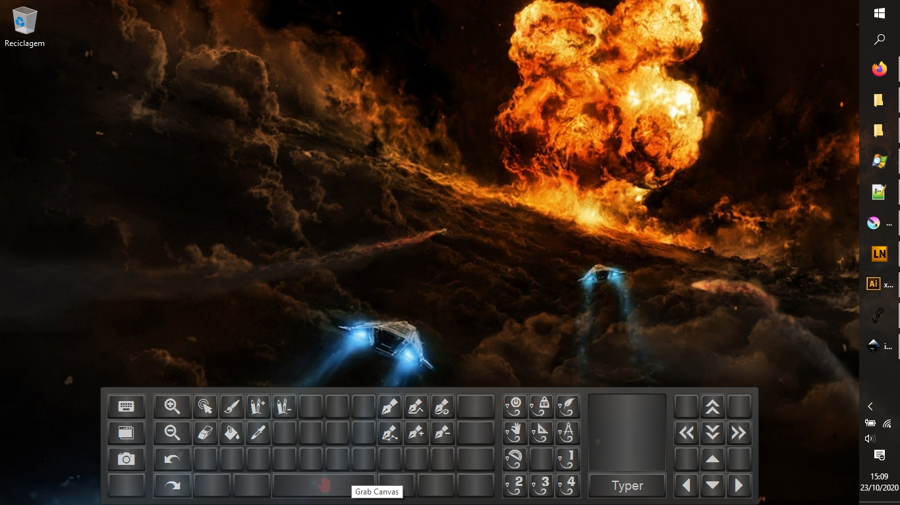

#
# XpressKeys 

Made by Alexandre Rodrigues Lopes [http://alexcrafter.blogspot.com/](http://alexcrafter.blogspot.com/)

version 5.0, 2020



#
# Intro

Hello mates!

This autohotkey script creates a handy virtual keyboard with shortcuts for any graphics editing software.

It was made with the purpose of reducing the need of a keyboard when working with digital tablets.

Things like changing from brush to eraser, to fill bucket, drag and zoom, and so on, become much more faster and intuitive.

You just have to match your specific software shortcuts for these actions with the hotkey commands sent by the gui.

#
# Install

Make sure you have [AutoHotkey](https://www.autohotkey.com/) installed for Windows.

Download this repository, install the XpressKeys.ttf font, and run `xpresskeys.ahk`. Trigger the GUI by pressing the `+` on your keyboard's numpad (NumpadPlus).
#
# Extras

There's a button that activates a virtual Keyboard.

It includes some compound keys, like accent and tilde effects on vowels, for latin languages.

The codes were developed from a QWERTY European Portuguese keyboard, so, if you need different symbols, you'll have to use the "key history panel" of Autohotkey to get your correct key codes.

The Xpress Typer button gives an extra option: it will inject the virtual keyboard strikes into a personal text box, and while this box is active, you can force-retype it into any place by pressing the middle-mouse button.
Do not forget to deactivate the Xpress Typer button when not needed, or any press of the middle-mouse button will retrigger the macro.
This was created since changing focus between the GUI and other windows made it impossible to edit certain text, like renaming a file, or changing the name of a layer.

#
# Customization

Everything was simplified.
`xpresskeys_keyboard_vars.txt` - If you have more buttons to add, just access this file. At the end, under `xpress keys`, you can add your custom buttons.
Positioning is based on a reference, so just access the image `keyboard1-map.jpg` to know where you want the button.
```
```
`xpresskeys_keyboard_map.txt` - This file stores the position and size of each button. At the start, there's definitions for the gui itself, and the Express Typer box.
```
```
`xpresskeys_keyboard_macros.txt` - This file manages overides for mouse buttons and other keys. It works in conjunction with
`xpresskeys_customhotkeys.txt` to change behaviour according to different softwares. It actually has overrides for Adobe Ilustrator, changing middle mouse button for drag, and mouse wheel for zoom in/zoom out.

#
# Changelog

## version 5.0
Total remake.
Eliminated the circular GUI and added the express buttons to the keyboard. Everything works neatly now.
Extras:
A button to open window navigation (Alt-Tab) - because doing it without a real keyboard was... ugh.
A button to take cute Snapshots. Just look for them in the images/screen capture folder. (Win+Printscreen)

## version 4.0
Drowned in a lot of stuff that I didn't care to write down. XD

## version 3.0
Some applications, as well as the windows explorer, will immediately close a text input when focus is lost. This makes using the express keyboard useless when trying to type text in there, or simple things like changing a file's name or editing a layer's name in photoshop.

A new feature was introduced: the Xpress Typer!
An input text box was added to the keyboard, and is activated by pressing the key `Typer`. When this input box is active, all keyboard keys divert their commands into it, instead of sending them to the target window.

While the input box is active, if you go to the target window and open any text area, you just have to press `middle mouse button` to transfer the text from the Xpress input box into the text area you want to edit.

NOTE: this method requires a pen with three buttons (one assigned to simulate middle mouse button), or a custom button in the display tablet that can be assigned to it.

The middle mouse button was chosen because it's the least intrusive while working with art software. Most of the times, it is only used to drag the canvas around.


## version 2.0

This version was modified to trigger the graphical Menu when pressing the Key "NumpadPlus".

Some display tablets and Art software do not allow the assignment of "Capslock" key.

Drag function was made to both the Main Gui and the Keyboard, for better visibility and functionality.

Restoring mouse position after the Gui is hidden was removed.

## version 1.0

Initial release.

#
# 

Hope you like it.

Have fun!

AlexL.
